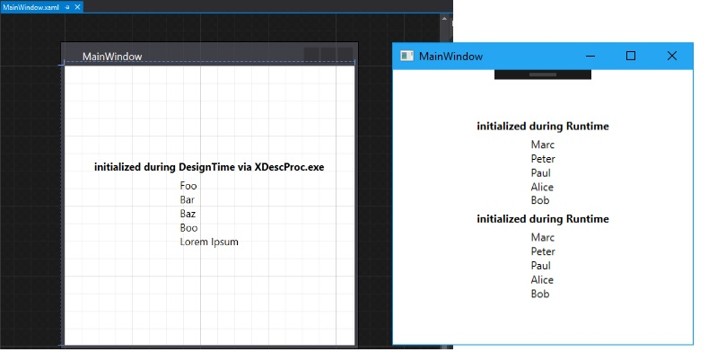
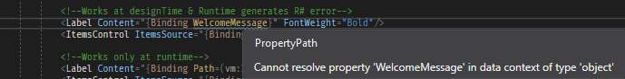

#### WPF  global viewmodel locator demo

Shows the resolving of Viewmodels works during Runtime and DesignTime via global ViewmodelResolver
so the view itself does knot need to know the Viewmodel.

Decorate Viewmodel Class with Optional DesignTimeData:

```csharp
 [ViewModel("MainWindow", designDataType:typeof(MainWindowDesignData))]
 internal class MainWindowViewModel : ViewModelBase, IMainWindowViewModel
 {
    ...
 }
```

set Datacontext to Locator in Xaml:

```xaml
<Window.DataContext>
        <Binding Source="{StaticResource GlobalVmLocator}" Path="[MainWindow]" />
</Window.DataContext>
```

DesignTime vs Runtime :




----
Sadly this produces an Resharper error:



Debugging tipps

- Start a second instance of Visual Studio 
- Attach the debugger to *XDesProc* Process (Xaml Designer Process)
- Close all Xaml designer windows and Reopen the one in which you wanna try to Debug the resolving of Design Instance Viewmodel
